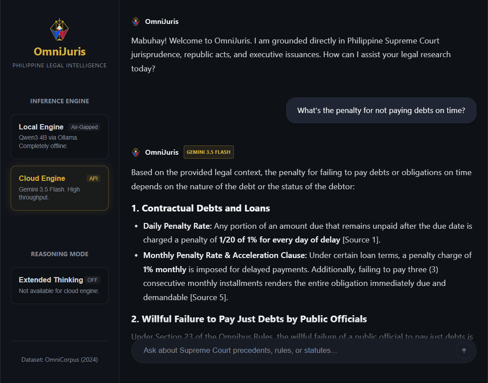

<div align="center">

<h1> OmniJuris – Philippine Legal Intelligence</h1>

A retrieval-augmented generation system over Philippine jurisprudence, built on the **Philippine OmniCorpus** dataset (Ramos, 2024). Powered by multilingual-e5-base embeddings, ChromaDB vector search, cross-encoder reranking, and dual inference engines: a locally-hosted Qwen3 4B via Ollama and Gemini 3.5 Flash.

</div>

<div align="center">
  
</div>

## 🛠️ Stack

<div align="center">

| Component | Technology |
| :--- | :--- |
| **Dataset** | Philippine OmniCorpus (HuggingFace) |
| **Embedding Model** | `intfloat/multilingual-e5-base` |
| **Vector Store** | ChromaDB (~800k vectors after cleaning) |
| **Reranker** | `cross-encoder/ms-marco-MiniLM-L-6-v2` |
| **Local LLM** | Qwen3 4B Instruct via Ollama |
| **Cloud LLM** | Gemini 3.5 Flash via Google AI API |
| **Backend** | FastAPI + streaming (SSE) |
| **Frontend** | React + TypeScript + Vite |

</div>

## ✨ Features

- **Natural language queries** over Philippine Supreme Court decisions, statutes, and executive issuances
- **Dual inference engine** - switch between local (air-gapped) and cloud (high throughput) at runtime
- **Extended thinking mode** for Qwen3 - step-by-step legal reasoning before answering
- **Cross-encoder reranking** for improved retrieval precision over baseline vector search
- **Token streaming** - live model output token streaming
- **Grounded answers** with source citations per response
- **Supports queries** in English and Filipino language

## 💡 Example Queries

* *"What is the penalty for estafa under the Revised Penal Code?"*
* *"Ano ang karapatan ng manggagawa sa illegal dismissal?"*
* *"What are the elements of murder versus homicide?"*
* *"What constitutes grave abuse of discretion?"*

## 📊 Dataset

This project uses the [**Philippine OmniCorpus**](https://huggingface.co/datasets/mongramosjr/philippine-omnicorpus) dataset by Dominador B. Ramos Jr., licensed under the Open Data Commons Attribution License (ODC-By) v1.0.

```
@software{mongramosjr2024philippine-omnicorpus,
author = {Ramos, Dominador Jr. B.},
title  = {Philippine Legal, Media, Cultural, and Historical Corpus},
month  = June,
year   = 2024,
url    = {https://huggingface.co/datasets/mongramosjr/philippine-omnicorpus}
}
```

## 📜 License

* **Code:** [MIT License](LICENSE)
* **Dataset:** [ODC-By v1.0](https://opendatacommons.org/licenses/by/1-0/)